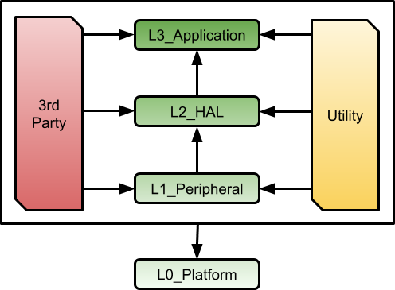

# Common Guidelines across Levels

level\_guide/L0-platform.rst level\_guide/L1-peripheral.rst
level\_guide/L2-hal.rst level\_guide/L3-application.rst

## Heirachy of inclusion

### Explanation

Arrows indicate which levels can include from. 
For example, L2\_HAL can include L1\_Peripherals, and 
L3\_Application can include L2\_HAL.
L3\_Applications should refrain from including L1\_Peripherals. 
If an L3\_Application needs to include from L1\_Peripherals, it 
must only take the peripheral interface and not a specific platforms driver.
L0\_Platform can include everything, except testing libraries, as its
startup may need code from any of the levels. In order to hit the
**light weight** goal, keep the code in startup to an absolute minimum.

Everything can include from `utility/` and `third_party/`. Although,
some third party libraries should not be included in some library code
levels. For example, microrl, used for command line control, should not
be included in anything in L1\_Peripherals or even L2\_HAL. There may be
consideration in the future to seperate the third party libraries into
their own set of levels that match the library levels.

This approach is meant to keep a levels of isolation between the
categories of files. Doing this can keep from circular dependencies and
unreasonable coupling between the layers.

Utilities are meant to be usable on all levels.